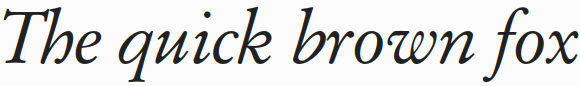

NewG8 is an open font family based on the original designs of Claude Garamond.

This project makes available the font from http://mirrors.ibiblio.org/CTAN/fonts/garamondx/ in otf and ttf format. It is an improved version of GaramondNo8 by (URW)++.

This fork modifies the fonts' character mappings and supports OpenType features, including standard ligatures (ff, fi, fl, fj, ffi, ffl, ffj), text figures, small capitals, superscript numerals, and a swash capital Q (under 'stylistic set 1'). There is otherwise no change to any of the glyphs' designs.

> Unlike most other fonts having Garamond as part of the name, the glyphs in this font are in fact digital renderings of fonts actually designed by Claude Garamond in the mid sixteenth century — most other Garamond fonts are closer to fonts designed by Jean Jannon some years later. The Stempel company owned the specimen from which they designed metal castings of the fonts in the 1920s. Early digital renderings include those by Bitstream under the name OriginalGaramond, and Stempel Garamond from Adobe, licensed from Linotype. (It appears that many of the deficiencies of fonts designed by Linotype were artifacts of the limitations of the machines for which the fonts were designed, and have in most cases not been corrected.) The latest version (TrueType, not PostScript) of the official (URW)++ GaramondNo8 is available from ftp://mirror.cs.wisc.edu/pub/mirrors/ghost/AFPL/GhostPCL/urwfonts-8.71.tar.bz2 which has a more extensive collection of glyphs than the PostScript versions.

Source: http://mirrors.ibiblio.org/CTAN/fonts/garamondx/doc/garamondx-doc.pdf

## Download

Fonts in OTF and TTF format can be downloaded from [GitHub Releases](../../releases/tag/continuous).

## Copyright and License

Modified version of garamondNo8 (Copyright (URW)++, Copyright 2000 by (URW)++ Design and Development). Modifications are Copyright 2012 by Michael Sharpe (msharpe@ucsd.edu) and are subject to the Aladdin Free Public Licence. Modified kerning data was based initially on a package by Gael Garoquaux. Modified character mappings by Bruce S.C. Lu 2021–2022.
